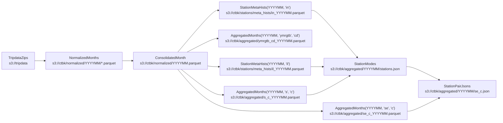

# `ctbk` python library
CLI for generating [ctbk.dev] datasets (derived from Citi Bike public data in [`s3://tripdata`]).

<!-- toc -->
- [Data flow](#data-flow)
    - [`TripdataZips` (a.k.a. `zip`s): public Citi Bike `.csv.zip` files](#zips)
    - [`TripdataCsvs` (a.k.a. `csv`s): unzipped and gzipped CSVs](#csvs)
    - [`NormalizedMonths` (a.k.a. `norm`s): normalize `csv`s](#normalized)
    - [`AggregatedMonths` (a.k.a. `agg`s): compute histograms over each month's rides:](#aggregated)
    - [`StationMetaHists` (a.k.a. `smh`s): compute station {id,name,lat/lng} histograms:](#station-meta-hists)
    - [`StationModes` (a.k.a. `sm`s): canonical {id,name,lat/lng} info for each station:](#station-modes)
    - [`StationPairJsons` (a.k.a. `spj`s): counts of rides between each pair of stations:](#station-pair-jsons)
- [Installation](#installation)
- [CLI](#cli)
    - [Subcommands: `urls`, `create`](#subcommands)
    - [Examples](#examples)
- [GitHub Actions](#ghas)
    - [`ci.yml`](#ci-yml)
    - [`www.yml`](#www-yml)
<!-- /toc -->

## Data flow <a id="data-flow"></a>



### `TripdataZips` (a.k.a. `zip`s): public Citi Bike `.csv.zip` files <a id="zips"></a>
- Released as NYC and JC `.csv.zip` files at s3://tripdata
- See [s3://tripdata](https://tripdata.s3.amazonaws.com/index.html)

### `TripdataCsvs` (a.k.a. `csv`s): unzipped and gzipped CSVs <a id="csvs"></a>
> **Orphaned** (~Feb 2025): `norm` now reads the `.csv.zip`s from `s3://tripdata` directly, so this stage no longer runs in the pipeline. The `csv` subcommand and the `s3://ctbk/csvs/` archive (frozen at 202501) are retained for reference only.
- Writes `<root>/ctbk/csvs/YYYYMM.csv`
- See also: [s3://ctbk/csvs]

### `NormalizedMonths` (a.k.a. `norm`s): normalize tripdata `.csv.zip`s <a id="normalized"></a>
- Read the `.csv.zip`s directly from `s3://tripdata` (no separate `csv` extract stage), merge regions (NYC, JC) for the same month, harmonize columns, drop duplicate data, etc.
- Writes `<root>/ctbk/normalized/YYYYMM.parquet`
- See also: [s3://ctbk/normalized]

### `AggregatedMonths` (a.k.a. `agg`s): compute histograms over each month's rides: <a id="aggregated"></a>
- Group by any of several \"aggregation keys\" ({year, month, day, hour, user type, bike
  type, start and end station, …})
- Produce any \"sum keys\" ({ride counts, duration in seconds})
- Writes `<root>/ctbk/aggregated/KEYS_YYYYMM.parquet`
- See also: [s3://ctbk/aggregated/*.parquet](https://ctbk.s3.amazonaws.com/index.html#/aggregated?p=8)

### `StationMetaHists` (a.k.a. `smh`s): compute station {id,name,lat/lng} histograms: <a id="station-meta-hists"></a>
- Similar to `agg`s, but counts station {id,name,lat/lng} tuples that appear as each
  ride's start and end stations (whereas `agg`'s rows are 1:1 with rides)
- "agg_keys" can include id (i), name (n), and lat/lng (l); there are no "sum_keys"
  (only counting is supported)
- Writes `<root>/ctbk/stations/meta_hists/YYYYMM.parquet`
- See also: [s3://ctbk/stations/meta_hists](https://ctbk.s3.amazonaws.com/index.html#/stations/meta_hists)

### `StationModes` (a.k.a. `sm`s): canonical {id,name,lat/lng} info for each station: <a id="station-modes"></a>
- Computed from `StationMetaHist`s:
    - `name` is chosen as the "mode" (most commonly listed name for that station ID)
    - `lat/lng` is taken to be the mean of the lat/lngs reported for each ride's start
      and end station
- Writes `<root>/ctbk/aggregated/YYYYMM/stations.json`
- See also: [s3://ctbk/aggregated/YYYYMM/stations.json](https://ctbk.s3.amazonaws.com/index.html#/aggregated)

### `StationPairJsons` (a.k.a. `spj`s): counts of rides between each pair of stations: <a id="station-pair-jsons"></a>
- JSON formatted as `{ <start idx>: { <end idx>: <count> } }`
- `idx`s are based on order of appearance in `StationModes` / `stations.json` above
  (which is also sorted by station ID)
- Values are read from `AggregatedMonths(<ym>, 'se', 'c')`:
    - group by station start ("s") and end ("e"),
    - sum ride counts ("c")
- Writes `<root>/ctbk/aggregated/YYYYMM/se_c.json`
- See also: [s3://ctbk/stations/YYYYMM/se_c.json](https://ctbk.s3.amazonaws.com/index.html#/aggregated)

## Installation <a id="installation"></a>

Clone this repo and install this library:
```bash
git clone https://github.com/hudcostreets/ctbk.dev
cd ctbk.dev
pip install -e ctbk
```

Then the `ctbk` executable will be available, which exposes a subcommand for each of the stages above:

## CLI <a id="cli"></a>

<!-- `bmdfff -- ctbk` -->
<details><summary><code>ctbk</code></summary>

```
Usage: ctbk [OPTIONS] COMMAND [ARGS]...

  CLI for generating ctbk.dev datasets (derived from Citi Bike public data in `s3://`).
  ## Data flow
  ### `TripdataZips` (a.k.a. `zip`s): Public Citi Bike `.csv.zip` files
  - Released as NYC and JC `.csv.zip` files at s3://tripdata
  - See https://tripdata.s3.amazonaws.com/index.html
  ### `TripdataCsvs` (a.k.a. `csv`s): unzipped and gzipped CSVs
  - **Orphaned** (~Feb 2025): `norm` reads the `.csv.zip`s directly, so this stage no longer
  runs; the `csv` subcommand + `s3://ctbk/csvs/` archive are retained for reference only.
  - Writes `<root>/ctbk/csvs/YYYYMM.csv`
  - See also: https://ctbk.s3.amazonaws.com/index.html#/csvs
  ### `NormalizedMonths` (a.k.a. `norm`s): normalize tripdata `.csv.zip`s
  - Read the `.csv.zip`s directly from `s3://tripdata` (no separate `csv` extract stage),
  merge regions (NYC, JC) for the same month, harmonize columns, drop duplicate data, etc.
  - Writes `<root>/ctbk/normalized/YYYYMM.parquet`
  - See also: https://ctbk.s3.amazonaws.com/index.html#/normalized
  ### `AggregatedMonths` (a.k.a. `agg`s): compute histograms over each month's rides:
  - Group by any of several "aggregation keys" ({year, month, day, hour, user type, bike
    type, start and end station, …})
  - Produce any "sum keys" ({ride counts, duration in seconds})
  - Writes `<root>/ctbk/aggregated/KEYS_YYYYMM.parquet`
  - See also: https://ctbk.s3.amazonaws.com/index.html#/aggregated?p=8
  ### `StationMetaHists` (a.k.a. `smh`s): compute station {id,name,lat/lng} histograms:
  - Similar to `agg`s, but counts station {id,name,lat/lng} tuples that appear as each
    ride's start and end stations (whereas `agg`'s rows are 1:1 with rides)
  - "agg_keys" can include id (i), name (n), and lat/lng (l); there are no "sum_keys"
    (only counting is supported)
  - Writes `<root>/ctbk/stations/meta_hists/KEYS_YYYYMM.parquet`
  - See also: https://ctbk.s3.amazonaws.com/index.html#/stations/meta_hists
  ### `StationModes` (a.k.a. `sm`s): canonical {id,name,lat/lng} info for each station:
  - Computed from `StationMetaHist`s:
    - `name` is chosen as the "mode" (most commonly listed name for that station ID)
    - `lat/lng` is taken to be the mean of the lat/lngs reported for each ride's start
      and end station
  - Writes `<root>/ctbk/aggregated/YYYYMM/stations.json`
  - See also: https://ctbk.s3.amazonaws.com/index.html#/aggregated
  ### `StationPairJsons` (a.k.a. `spj`s): counts of rides between each pair of stations:
  - JSON formatted as `{ <start idx>: { <end idx>: <count> } }`
  - `idx`s are based on order of appearance in `StationModes` / `stations.json` above
    (which is also sorted by station ID)
  - Values are read from `AggregatedMonths(YYYYMM, 'se', 'c')`:
    - group by station start ("s") and end ("e"),
    - sum ride counts ("c")
  - Writes `<root>/ctbk/aggregated/YYYYMM/se_c.json`
  - See also: https://ctbk.s3.amazonaws.com/index.html#/aggregated

Options:
  --help  Show this message and exit.

Commands:
  import                    Import s3://tripdata `.zip` files.
  zip                       Read .csv.zip files from s3://tripdata
  csv                       Extract CSVs from "tripdata" .zip files.
  normalized                Normalize "tripdata" CSVs (combine regions...
  consolidated              Consolidate normalized parquet files (combine...
  aggregated                Aggregate normalized ride entries by various...
  station-meta-hist         Aggregate station name, lat/lng info from...
  station-modes-json        Compute canonical station names, lat/lngs...
  station-pairs-json        Write station-pair ride_counts keyed by...
  partition                 Separate pre-2024 parquets (`normalized/v0`)...
  dag                       Show stage-level pipeline DAG
  tripdata-summary          Emit `tripdata/latest.json` summary to stdout.
  update                    Run full pipeline for a month: normalize...
  trips-per-station         Emit per-canonical-station raw-ride parquets...
  trips-region-h1           Build hour-level region rollup for a (region,...
  trips-region-n1           Build minute-level region rollup for a...
  avail-agg-h1              Build daily h1 (1-hour bucket) histogram from...
  avail-agg-d1              Build monthly d1 (1-day bucket) histogram...
  avail-agg-mo1             Build yearly mo1 (1-month bucket) histogram...
  avail-raw-day             Build per-day raw availability bundle from h1...
  trips-agg-h1              Build h1 (1-hour bucket, 1-month file) trips...
  trips-agg-d1              Build d1 (1-day bucket, 1-year file) trips agg.
  trips-agg-mo1             Build mo1 (1-month bucket, 1-decade file)...
  avail-v3-build            Build <prefix>/<tier>/<period>.parquet shards...
  avail-v3-cascade-from-1m  Single-pass cascade: emit all 17 derived...
  avail-loader-replay       Backfill gbfs/avail/agg=1m/cons=1m/ from WAL...
  rides-v1-build            Build...
  rides-v3-extend           Monthly rides-v3 (rollback pyramid) extension...
  station-luc-build         Build station-luc.json (canonical short_name...
  neighborhoods             Build `neighborhoods.json` (NYC NTA + JC...
  pyramid-cascade           Report missing (tier, shard_dur, period)...
  gbfs                      GBFS pipeline ops: D1 queries, cascade ticks,...
  station-harmonize         Station harmonization: map all historical IDs...
  station-trips-json        Generate per-station ymdgtb_cd.json files...
  yms                       Print one or more YM (year-month) ranges, e.g.:
```
</details>


<!-- `bmdfff -- ctbk zip --help` -->
<details><summary><code>ctbk zip --help</code></summary>

```
Usage: ctbk zip [OPTIONS] COMMAND [ARGS]...

  Read .csv.zip files from s3://tripdata

Options:
  --help  Show this message and exit.

Commands:
  urls  Print URLs for selected datasets
  prep  Generate .dvc specs with computation provenance (DVX prep phase)
  run   Execute stale computations via DVX (run phase)
```
</details>

<!-- `bmdfff -- ctbk csv --help` -->
<details><summary><code>ctbk csv --help</code></summary>

```
Usage: ctbk csv [OPTIONS] COMMAND [ARGS]...

  Extract CSVs from "tripdata" .zip files. Writes to <root>/ctbk/csvs.

Options:
  --help  Show this message and exit.

Commands:
  urls    Print URLs for selected datasets
  create  Create selected datasets
  prep    Generate .dvc specs with computation provenance (DVX prep phase)
  run     Execute stale computations via DVX (run phase)
  sort    Sort one or more `.csv{,.gz}`'s in-place, remove empty lines
```
</details>

<!-- `bmdfff -- ctbk normalized --help` -->
<details><summary><code>ctbk normalized --help</code></summary>

```
Usage: ctbk normalized [OPTIONS] COMMAND [ARGS]...

  Normalize "tripdata" CSVs (combine regions for each month, harmonize column
  names, etc. Populates directory `<root>/ctbk/normalized/YYYYMM/` with files
  of the form `YYYYMM_YYYYMM.parquet`, for each pair of (start,end) months
  found in a given month's CSVs.

Options:
  --help  Show this message and exit.

Commands:
  urls    Print URLs for selected datasets
  create  Create selected datasets
  prep    Generate .dvc specs with computation provenance (DVX prep phase)
  run     Execute stale computations via DVX (run phase)
```
</details>

<!-- `bmdfff -- ctbk partition --help` -->
<details><summary><code>ctbk partition --help</code></summary>

```
Usage: ctbk partition [OPTIONS] COMMAND [ARGS]...

  Separate pre-2024 parquets (`normalized/v0`) by {src,start,end} months.

Options:
  --help  Show this message and exit.

Commands:
  prep  Generate .dvc specs with computation provenance (DVX prep phase).
  run   Execute partition for given months.
```
</details>

<!-- `bmdfff -- ctbk consolidate --help` -->
<details><summary><code>ctbk consolidate --help</code></summary>

```
Usage: ctbk consolidate [OPTIONS] COMMAND [ARGS]...

  Consolidate normalized parquet files (combine regions for each month,
  harmonize column names, etc. Populates directory
  `<root>/ctbk/normalized/YYYYMM/` with files of the form
  `YYYYMM_YYYYMM.parquet`, for each pair of (start,end) months found in a
  given month's CSVs.

Options:
  --help  Show this message and exit.

Commands:
  urls    Print URLs for selected datasets
  create  Create selected datasets
  prep    Generate .dvc specs with computation provenance (DVX prep phase)
  run     Execute stale computations via DVX (run phase)
```
</details>

<!-- `bmdfff -- ctbk aggregated --help` -->
<details><summary><code>ctbk aggregated --help</code></summary>

```
Usage: ctbk aggregated [OPTIONS] COMMAND [ARGS]...

  Aggregate normalized ride entries by various columns, summing ride counts or
  durations. Writes to <root>/ctbk/aggregated/KEYS_YYYYMM.parquet.

Options:
  --help  Show this message and exit.

Commands:
  urls    Print URLs for selected datasets
  create  Create selected datasets
  prep    Generate .dvc specs with computation provenance (DVX prep phase)
  run     Execute stale computations via DVX (run phase)
```
</details>

<!-- `bmdfff -- ctbk station-meta-hist --help` -->
<details><summary><code>ctbk station-meta-hist --help</code></summary>

```
Usage: ctbk station-meta-hist [OPTIONS] COMMAND [ARGS]...

  Aggregate station name, lat/lng info from ride start and end fields. Writes
  to <root>/ctbk/stations/meta_hists/KEYS_YYYYMM.parquet.

Options:
  --help  Show this message and exit.

Commands:
  urls    Print URLs for selected datasets
  create  Create selected datasets
  prep    Generate .dvc specs with computation provenance (DVX prep phase)
  run     Execute stale computations via DVX (run phase)
```
</details>

<!-- `bmdfff -- ctbk station-modes-json --help` -->
<details><summary><code>ctbk station-modes-json --help</code></summary>

```
Usage: ctbk station-modes-json [OPTIONS] COMMAND [ARGS]...

  Compute canonical station names, lat/lngs from StationMetaHists. Writes to
  <root>/ctbk/aggregated/YYYYMM/stations.json.

Options:
  --help  Show this message and exit.

Commands:
  urls    Print URLs for selected datasets
  create  Create selected datasets
  prep    Generate .dvc specs with computation provenance (DVX prep phase)
  run     Execute stale computations via DVX (run phase)
```
</details>

<!-- `bmdfff -- ctbk station-pairs-json --help` -->
<details><summary><code>ctbk station-pairs-json --help</code></summary>

```
Usage: ctbk station-pairs-json [OPTIONS] COMMAND [ARGS]...

  Write station-pair ride_counts keyed by StationModes' JSON indices. Writes
  to <root>/ctbk/aggregated/YYYYMM/se_c.json.

Options:
  --help  Show this message and exit.

Commands:
  urls    Print URLs for selected datasets
  create  Create selected datasets
  prep    Generate .dvc specs with computation provenance (DVX prep phase)
  run     Execute stale computations via DVX (run phase)
```
</details>

### Subcommands: `urls`, `create` <a id="subcommands"></a>

Each of the `ctbk` commands above supports 3 further subcommands:
- `urls`: print the URLs that would be read from or written to
- `create`: compute and save the relevant data to those URLs (optionally no-op'ing if already present, overwriting, or failing if not present)

### Examples <a id="examples"></a>

#### `urls`: print URLS
Print URLs for 3 months of [`normalized`] data in the local s3/ folder:
```bash
ctbk normalized -d 202206-202209 urls
# s3/ctbk/normalized/202206.parquet
# s3/ctbk/normalized/202207.parquet
# s3/ctbk/normalized/202208.parquet
```

#### `create`: create+save data
Compute one month of [`normalized`] ride data:
```bash
ctbk normalized -d202101 create
```

This reads upstream CSVs from the local `s3/ctbk/csvs/` directory and writes normalized parquet files to `s3/ctbk/normalized/`.

Note: stderr messages about `Rideable Type` not being found are due to older months predating the addition of that column in February 2021.

**Current create options include:**
- `-e, --engine`: Parquet engine selection
- `-t, --name-type INTEGER`: CSV name-type preference
- `-G, --no-git`: Skip git/DVC workflow integration

Generate all the data used by [ctbk.dev] in the local `s3/ctbk` directory:

```bash
ctbk station-pairs-json create
```

- `station-pairs-json` (abbreviated as `spj`) is the final derived data product in [the diagram above](#data-flow)
- Creating station-pair JSONs requires creating all predecessor datasets in the pipeline
- Data is stored in the local `s3/ctbk/` directory structure
- Initial [`TripdataZips`] are downloaded from the public [`s3://tripdata`] bucket

⚠️ takes O(hours), streams ≈7GB of [`.csv.zip`s](#zips) from [`s3://tripdata`], writes ≈12GiB under `s3/ctbk/` locally.

### Abbreviated command names
Abbreviations for each subcommand are supported, e.g. `n` for `normalized`:
```bash
ctbk n -d2022- urls
```

## GitHub Actions <a id="ghas"></a>

### [`ci.yml`] <a id="ci-yml"></a>
[`ci.yml`] ingests each newly-published month by running the whole pipeline in one call:
```bash
ctbk update -S <YYYYMM>
```
(`norm` → `cons` → `smh` → `agg` ×5 → `sm` → `spj` → `station-trips-json` → www station-urls; see [`ctbk/update.py`](update.py)). The rides rollup-pyramid rebuild (R2-only) runs afterward as a separate best-effort step.

Any DVX/www changes are pushed to [the www branch], which triggers [the `www.yml` GHA](#www-yml).

### [`www.yml`] <a id="www-yml"></a>
[The `www.yml` GHA][www GHA]:
- runs on pushes to [the www branch]
- rebuilds and deploys the site

The code for the site is under [../www](../www).

[`s3://ctbk`]: https://ctbk.s3.amazonaws.com/index.html
[s3://ctbk/csvs]: https://ctbk.s3.amazonaws.com/index.html#/csvs
[`s3://ctbk/csvs`]: https://ctbk.s3.amazonaws.com/index.html#/csvs
[s3://ctbk/normalized]: https://ctbk.s3.amazonaws.com/index.html#/normalized
[`s3://ctbk/normalized`]: https://ctbk.s3.amazonaws.com/index.html#/normalized
[`s3://tripdata`]: https://tripdata.s3.amazonaws.com/index.html
[ctbk.dev]: https://ctbk.dev
[`ci.yml`]: ../.github/workflows/ci.yml
[`www.yml`]: ../.github/workflows/www.yml
[@www]: https://github.com/hudcostreets/ctbk.dev/tree/www
[the www branch]: https://github.com/hudcostreets/ctbk.dev/tree/www
[www GHA]: https://github.com/hudcostreets/ctbk.dev/actions/workflows/www.yml

[`zips`]: #zips
[`TripdataZips`]: #zips
[`csvs`]: #csvs
[`normalized`]: #normalized
[`NormalizedMonth`]: #normalized
[`aggregated`]: #aggregated
[`station-pair-json`]: #station-pair-jsons

[`parquet2json`]: https://github.com/jupiter/parquet2json
